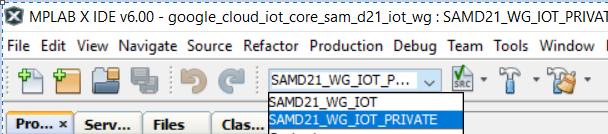
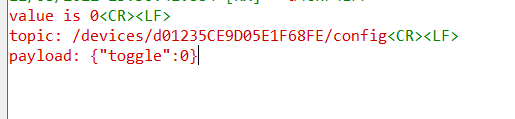

# SAMD21_MQTT_TLS12_GoogleCloudIOT

This demonstration comprises components such as MQTT, and TLSv1.2.
It has connection to the service provided by Google Cloud IOT.
Microprocessor used is ATSAMD21G18A based on ARM Cortex M0+.

### Environment:
1. Board: SAM-IOT WG, EV75S95A
2. Harmony V3
3. MPLABX v6
4. XC32 v

### Instruction:

Open MPLABX IDE. Choose configuration **SAMD21_WG_IOT_PRIVATE**,

Build project and upload program to the board. 
Connect the board to the laptop/pc. The board will appear as drive. Access the drive.
Double click on CLICK-ME.htm. Configure your WIFI SSID etc.

## Google CLOUD:

Configure you Google Cloud console private account.
Go to https://console.cloud.google.com/
1. Enable billing and permission for,
   1. IOT CORE
   2. PUB SUB
2. Create registry in IOT CORE. Name it my-registry 
   1. Region: us-central1
   2. Protocol: MQTT
   
   
3. Create topic in PUB/SUB
   1. my-device-events
4. Create subscription in PUBSUB-Subscriptions
   1. my-subscription
   2. 
5. Create devices under IOT CORE. You should know your device id.
   Eg. d01235CE9D05E1F68FE
   
6. Add device authentication key. It's a public key. Must be the same with the one used in your client board.
   
7. Done!

### Output

Open your terminal. Use baud rate 9600.
If connection to Google Cloud successful, you should find the output below,

Go to your google PUB SUB picture below.

Pull the data. You should find the list of datas such as {"Light":181,"Temp":"34.437500","Switch 0":"1","Switch 1":"1"}
under column "Message body" picture below.

